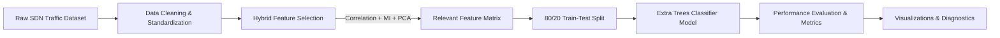

# SDN-Guard: Machine Learning-Based Software-Defined Networking Intrusion Detection

[](https://www.python.org/)
[](https://jupyter.org/)
[](https://scikit-learn.org/)
[](LICENSE)

An advanced Machine Learning framework for Intrusion Detection in Software-Defined Networks (SDN) and IoT environments. This project performs network traffic feature extraction, multi-dimensional feature selection (Correlation Analysis, Mutual Information, and PCA), and predictive classification using Ensemble Machine Learning algorithms such as Extra Trees and Random Forest.

---

## 📌 Table of Contents

- [Overview](#-overview)
- [Suggested Project Names](#-suggested-project-names)
- [Key Features](#-key-features)
- [Dataset Characteristics](#-dataset-characteristics)
- [Machine Learning Pipeline](#-machine-learning-pipeline)
- [Model Performance & Results](#-model-performance--results)
- [Repository Structure](#-repository-structure)
- [Installation & Setup](#-installation--setup)
- [Usage](#-usage)
- [License](#-license)

---

## 🔍 Overview

Software-Defined Networking (SDN) offers centralized control and dynamic network management, but its centralized architecture also creates high-value targets for cyberattacks such as DDoS, Port Scanning, and Botnet traffic.

**SDN-Guard** leverages machine learning to automatically analyze SDN flow metrics, classify network traffic, and accurately detect malicious activities with low execution latency and maximum precision.

---

## 💡 Suggested Project Names

Depending on your presentation or paper focus, here are a few suggested names for this repository:

1. **SDN-Guard** (Recommended) — *Software-Defined Networking Intrusion Detection System*
2. **SDN-FlowShield** — *Machine Learning Attack Classification for SDN Traffic*
3. **AlperKaan35-SDN-IDS** — *Machine Learning Benchmark & Feature Selection for SDN Security*
4. **NetFlow-IDS-SDN** — *Ensemble Learning Framework for Software-Defined Networks*

---

## ✨ Key Features

- **Comprehensive Data Preprocessing**:
  - Null value handling, inf/nan replacement, and duplicate removal (processed over 200,000 traffic records).
  - Categorical label encoding and feature standardization (`StandardScaler`).
- **Hybrid Feature Selection Engine**:
  - **Correlation Analysis**: Identifies highly correlated network attributes ($r > 0.5$).
  - **Mutual Information (`SelectKBest`)**: Captures non-linear dependencies between features and target labels.
  - **Principal Component Analysis (PCA)**: Extracts primary variance components.
  - **Feature Fusion**: Combines top features from all three techniques to create an optimal feature space.
- **Ensemble Machine Learning**:
  - Trained and tuned **Extra Trees Classifier** and **Random Forest Classifier**.
  - Hyperparameter evaluation: Accuracy vs. Number of Trees ($N \in [1, 100]$).
- **Multi-Metric Model Evaluation**:
  - Accuracy, Precision, Recall, F1-Score, Confusion Matrix, Cohen's Kappa ($\kappa$), ROC-AUC, Balanced Accuracy (BACC), False Positive Rate (FPR), and True Positive Rate (TPR).
  - Microsecond-level training and testing latency benchmarking.
- **Rich Visualizations**:
  - Confusion Matrix heatmaps via `seaborn`.
  - Traffic class distribution pie charts.
  - Hyperparameter performance curves via `matplotlib`.

---

## 📊 Dataset Characteristics

The dataset analyzed (`10IOT_35000_each.csv`) comprises **210,000 raw network traffic flow records** across 33 numerical and categorical attributes:

| Attribute Category | Key Features |
| :--- | :--- |
| **Network Identifiers** | `srcMAC`, `dstMAC`, `srcIP`, `dstIP`, `srcPort`, `dstPort` |
| **Protocol & Timing** | `Protocol`, `proto_number`, `Dur`, `last_seen` |
| **Packet Statistics** | `Pkts`, `Bytes`, `Spkts`, `Dpkts`, `Sbytes`, `Dbytes` |
| **Rate Metrics** | `Srate`, `Drate`, `Mean`, `Stddev`, `Min`, `Max`, `Sum` |
| **SDN / Flow Aggregations** | `TnBPSrcIP`, `TnBPDstIP`, `TnP_PSrcIP`, `TnP_PDstIP`, `TnP_PerProto`, `TnP_Per_Dport`, `N_IN_Conn_P_DstIP`, `N_IN_Conn_P_SrcIP` |
| **Ground Truth Targets** | `Attack` (Binary: 0.0 = Normal, 1.0 = Attack), `Category` (Multi-class attack categories) |

---

## ⚙️ Machine Learning Pipeline



1. **Data Ingestion & Cleaning**: Load dataset, remove 1,330 duplicate records, encode MAC addresses, IP addresses, and protocol specs.
2. **Feature Engineering**: Standardize numeric columns using Scikit-Learn's `StandardScaler`.
3. **Feature Selection**: Select top 32 relevant network metrics to prevent overfitting and speed up model execution.
4. **Model Training & Validation**: Fit `ExtraTreesClassifier(n_estimators=10)` on 168,103 training samples and evaluate on 40,567 test samples.
5. **Hyperparameter Analysis**: Evaluate tree scaling from 1 to 100 trees to observe generalization performance.

---

## 📈 Model Performance & Results

Evaluating the tuned **Extra Trees Classifier** on the 40,567 test instances yields state-of-the-art results:

| Metric | Score / Value |
| :--- | :--- |
| **Test Accuracy** | **1.0000 (100%)** |
| **Precision (Weighted)** | **1.0000** |
| **Recall (Weighted)** | **1.0000** |
| **F1-Score** | **1.0000** |
| **Balanced Accuracy (BACC)** | **1.0000** |
| **ROC-AUC Score** | **1.0000** |
| **Cohen's Kappa ($\kappa$)** | **1.0000** |
| **Average FPR** | **0.0000** |
| **Training Time** | ~0.68 seconds |

---

## 📁 Repository Structure

```text
AlperKaan35SDNDataset-main/
│
├── AlperKaan35_SDN_Dataset.ipynb   # Complete Jupyter Notebook (Preprocessing, Feature Selection, Training, Plots)
└── README.md                       # Project Documentation
```

---

## 🛠️ Installation & Setup

### Prerequisites

- Python 3.8+
- Jupyter Notebook / JupyterLab / Google Colab

### Environment Setup

1. Clone or download this repository:
   ```bash
   git clone https://github.com/your-username/SDN-Guard.git
   cd SDN-Guard
   ```

2. Create a virtual environment (optional but recommended):
   ```bash
   python -m venv venv
   source venv/bin/activate  # On Windows: venv\Scripts\activate
   ```

3. Install required Python packages:
   ```bash
   pip install --upgrade scikit-learn pandas numpy matplotlib seaborn
   ```

---

## 🚀 Usage

1. Open the Jupyter Notebook:
   ```bash
   jupyter notebook AlperKaan35_SDN_Dataset.ipynb
   ```

2. Specify your local or Google Drive path for the dataset `10IOT_35000_each.csv`:
   ```python
   fp = 'path/to/10IOT_35000_each.csv'
   df = pd.read_csv(fp)
   ```

3. Run all cells to execute feature selection, model training, confusion matrix rendering, and accuracy vs. tree size plotting.


